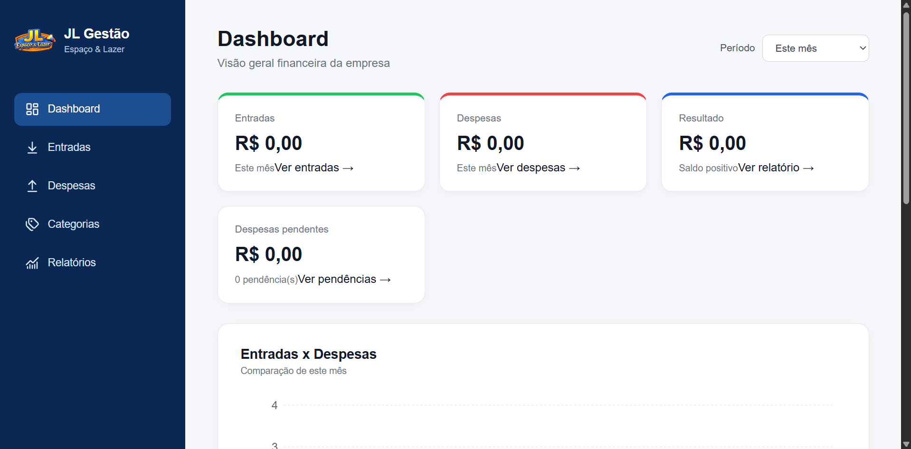

# JL Gestão

Sistema de gestão financeira desenvolvido para registrar e acompanhar entradas, despesas e resultados de uma empresa de forma simples e organizada.

## Sobre o projeto

O **JL Gestão** foi criado para auxiliar no controle financeiro diário da JL Espaço e Lazer. A aplicação permite registrar movimentações, organizar despesas por categoria e consultar o resultado financeiro do negócio.

O projeto está em desenvolvimento e faz parte do meu aprendizado em desenvolvimento full stack.

## Funcionalidades

- Cadastro e consulta de entradas;
- Cadastro e consulta de despesas;
- Classificação das despesas por categoria e status;
- Registro de empresas;
- Diferentes formas de pagamento;
- Consulta do resumo financeiro;
- Cálculo do resultado com base nas entradas e despesas.

## Tecnologias utilizadas

- Java 21;
- Spring Boot;
- Spring Data JPA;
- Maven;
- PostgreSQL;
- API REST.

## Estrutura do projeto

```text
src/main/java/com/jlgestao
├── config
├── controller
├── model
└── repository
```

## Como executar o projeto

### Pré-requisitos

- Java 21 instalado;
- PostgreSQL instalado e em execução;
- Git instalado;
- IntelliJ IDEA ou outra IDE compatível com Java.

### Configuração do banco de dados

Crie no PostgreSQL um banco chamado:

```text
jl_gestao
```

Configure estas variáveis de ambiente na sua IDE:

```text
DB_USERNAME=seu_usuario_do_postgresql
DB_PASSWORD=sua_senha_do_postgresql
```

As credenciais reais não devem ser adicionadas ao repositório.

### Execução

Clone o repositório:

```bash
git clone COLOQUE_AQUI_O_LINK_DO_REPOSITORIO
```

Entre na pasta:

```bash
cd jl-gestao
```

No Windows, execute:

```bash
mvnw.cmd spring-boot:run
```

Também é possível abrir o projeto no IntelliJ IDEA e executar a classe `JlGestaoApplication`.

## Imagens do projeto

As imagens da interface serão adicionadas conforme o desenvolvimento do sistema.

<!--
Exemplo para adicionar uma imagem:


-->

## Status

Projeto em desenvolvimento.

## Próximas melhorias

- Aprimorar os relatórios por período;
- Adicionar mais filtros de consulta;
- Integrar completamente o front-end à API;
- Adicionar imagens demonstrativas;
- Preparar a aplicação para implantação.

## Autora

Desenvolvido por **Vitória**.
